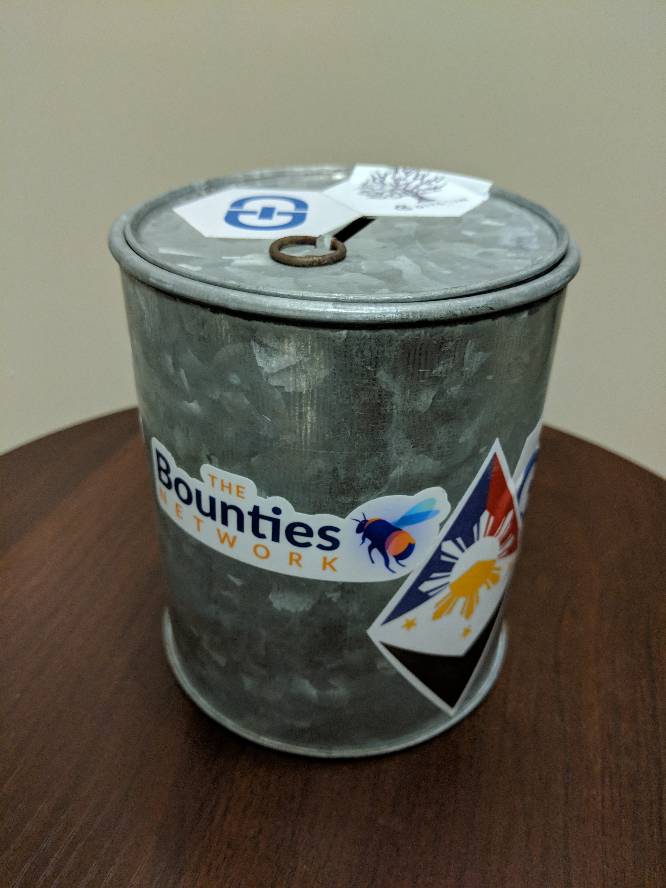

# A Vision of Hope

In February of 2018, ConsenSys held its second company retreat in Albufeira, Portugal. That week, we played a game that was a prototype of Panvala. Instead of tokens on a blockchain, we used poker chips, and instead of smart contracts enforcing the rules, we had a gamemaster. But the core of the system was the same: tokens were issued to people who pursued our shared goals, and donors bought those tokens in the hallways of the resort so they could deposit them back into the token capacitor: a metal can full of poker chips.

What excites me most about launching Panvala is that more people will be able to feel what a few players felt that week as they played the game. There isn’t a word to describe how the game makes you feel—it’s not a common enough feeling to have earned a name yet. But after you feel that nameless feeling, the feeling that follows will be familiar, and it has a name we all know: that feeling is hope.

Ethereum can be—and should be—the settlement layer for the world’s open financial system. While that future isn’t guaranteed, I’m confident that with the right tools, this will be one of many goals our community achieves together. After all, we’re the people who demonstrated that smart contracts could be usefully deployed on public networks when many doubted that it was possible. When TheDAO hack put 14% of all Ether at risk, we’re the people who endured the turmoil of the hard fork to protect the future of the network. And when everyone thought scammy ICOs were all that Ethereum was good for, we kept building through the crypto winter to make sure that the next time the public pays attention, they’ll see things that used to be impossible.

I expect that Panvala will work, but that doesn’t mean that it should never be changed. Panvala wasn’t built to serve any ideology, or to unintentionally create a new one based on the quirks of the system we’ve built. Some of the system is based on assumptions and shortcuts that seem fine now, but might not be in the future. In some areas, we’ve intentionally made the system hard to change, not because we know better than you, but because no one wants to start playing a new game where critical rules are easy to change. I hope that these constraints serve you well, and if time and experience teach you more than we know now, that you free yourself from those constraints.

I believe \(perhaps irrationally\) that Panvala truly is a more effective way to coordinate voluntary cooperation than we’ve ever seen. If that is true, there’s no way we’ll stop once we’ve solved the problems that currently face the Ethereum community. We’ll still be holding pan, so we’ll still want more people to want to make donations with pan. Rather than stop after our first goal, we will expand our mission to attract more patrons, more sponsors, and more donations. From where we are today, we’ll reach out to find anyone out there that might share the same goals and dreams for what we can accomplish together, and each day we’ll write the story of how we solved the problems that once seemed unsolvable.

That's what the promise has been for the last technology that enabled permissionless innovation over the past few decades. Before the internet, you needed the money and connections to get AT&T’s permission to launch any new idea that relied on a network of connected people. After the internet, you could be any geek off the street coding in your poorly lit dorm room while wearing your latest free t-shirt, but if people really wanted the idea in your head, you could reach the world without any gatekeeper's approval.

That's what I believe this technology will do for our economy, for our politics, and for our society. If you feel like you don't matter in today’s world that is dominated by unprecedented concentrations of power, I hope Panvala will be a revelation.

You've always mattered.

