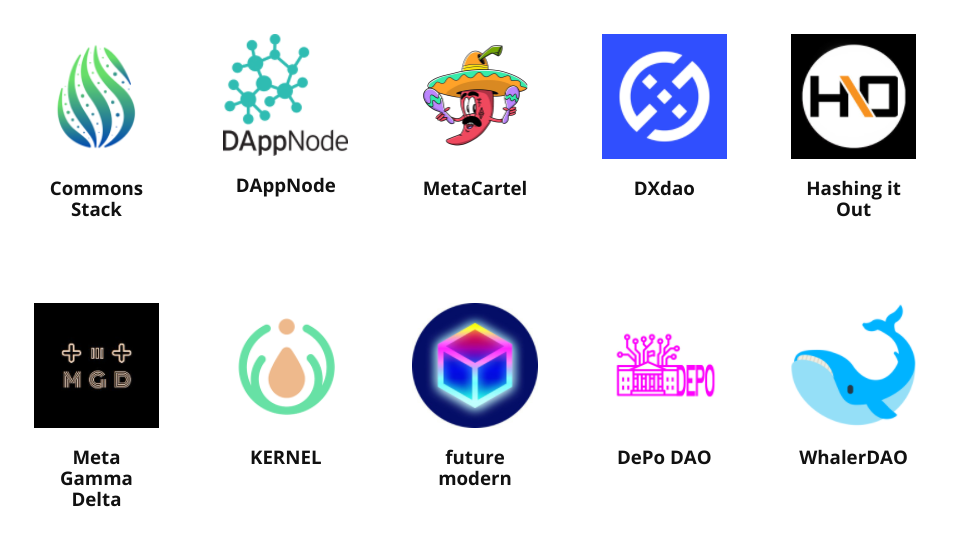

# Panvala League

Communities in the Panvala League stake PAN tokens to earn donation matching capacity from Panvala's inflation. The existing communities in the League have a strong influence over which communities to add to the League. In recent quarters, 75% of Panvala's quarterly inflation has been allocated to the Panvala League, which was able to [match donations for each community at an average of **10.26x** last quarter](https://forum.panvala.com/t/panvala-league-funding-recap-for-batch-eight-september-2020/229).

We want your community to join the Panvala League! Continue on to Expanding the League to learn more about how we grow.



For more details on how we divide the Panvala League's portion of the inflation each quarter, continue on to Scoreboard Rules.



