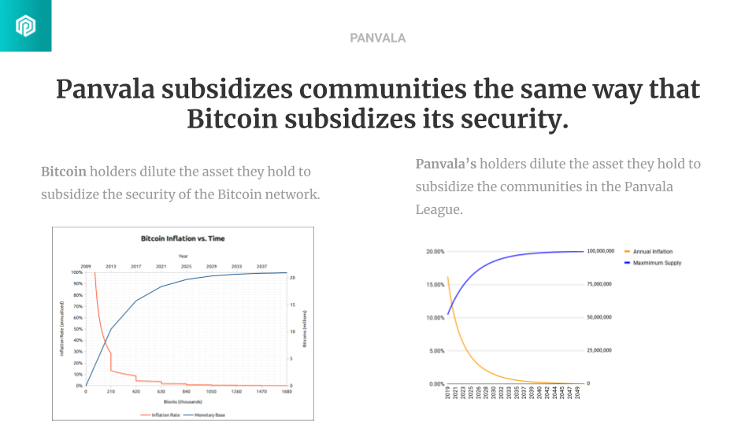
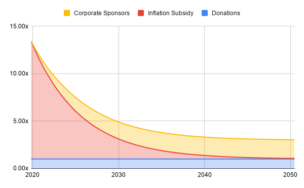

# PAN Token Economics

Panvala’s matching funds don’t come from a foundation or wealthy benefactors. **Participating in Panvala allows communities to create their own matching funds.** Panvala’s economics are modeled on Bitcoin, which funds the network using inflationary block rewards. When you hold BTC, you’re opting into a system where you know your holdings will be diluted up to the maximum supply of 21 million BTC to fund block rewards for miners. Similarly, Panvala’s stakers have opted into a system where they will be diluted up to a maximum supply of 100 million PAN, and the Panvala League’s communities allocate that inflation themselves.

## Token Supply

There are three portions of the token supply to keep in mind:

* The **circulating supply** consists of the tokens that have already been allocated \(48,581,501 PAN as of November 1\).
* The **decaying supply** consists of the tokens that are locked and released with a half-life of four years, the same half-life as Bitcoin uses \(41,418,499 PAN as of November 1\).
* The **reserved supply** consists of 10 million PAN that the token holders can allocate as needed. This is intended for exceptional opportunities to expand Panvala that cannot be achieved with the quarterly inflation. \(10,000,000 PAN as of November 1\)

## Net Inflation

A key difference from Bitcoin's model is that in Panvala, **all donations go back into the decaying supply**. That means the supply curve doesn't project the actual circulating supply in the future, it projects the _maximum_ supply. In reality, every donation reduces the actual circulating supply.

The model in the chart above reaches equilibrium at an annual budget around 1,000,000 PAN that can be sustained indefinitely. In the long run, the flow of donations puts downward pressure on the circulating supply that fluctuates based on economic conditions. Those fluctuations are a result of changes in the value of PAN, and changes in the flow of donations.

| Batch | End of Donations | PAN Price | PAN Donated | Value Donated | Multiplier | Max Inflation | Net Inflation | Net Inflation % |
| :--- | :--- | :--- | :--- | :--- | :--- | :--- | :--- | :--- |
| 6 | 4/7/2020 | $0.02510 | 397,559.47 | $9,978.74 | 4.94x | 1,964,644.00 | 1,567,084.53 | 3.60% |
| 7 | 7/3/2020 | $0.03571 | 355,105.16 | $12,680.81 | 5.35x | 1,899,401.00 | 1,544,295.84 | 3.40% |
| 8 | 10/2/2020 | $0.11055 | 158,206.96 | $17,490.25 | 11.55x | 1,826,580.00 | 1,668,373.04 | 3.56% |

To get an idea of what these fluctuations look like, consider the inflation for the past few quarters. The value of PAN increased through each quarter, but between July 3 and October 10, PAN's price increase outpaced the increase in the value of the donations. As a result, the quantity of PAN donated decreased from 355,105 to 158,206 even though the dollar value of those donations increased. The **maximum inflation** allowed by Panvala's smart contracts _decreases_ each quarter, but since donated PAN are removed from the circulating supply, the **net inflation** actually _increased_ between those two quarters!


When the price of PAN _rises_ faster than the flow of donations, the **net inflation** rises as well. Similarly, when the price of PAN _falls_ faster than the flow of donations, the net inflation decreases. As the market decides how to value PAN, we expect that sort of volatility to decrease, and the trajectory of Panvala's inflation will stabilize, as will its multiplier.


## Endgame

Once the circulating supply reaches equilibrium in a decade or two, there are no inflation subsidies available: for every token going into the token supply as a donation, there's one token coming out as inflation. This is similar to the end goal for the Bitcoin network to rely only on transaction fees instead of block rewards.

Over time, Panvala will approach its maximum supply, and the inflation subsidies will decrease. Our hypothesis is that we could have a decade or two of healthy inflation subsidies before they taper off. That’s why Panvala doesn’t just pursue inflation subsidies for communities: we pursue all possible subsidies for communities. As the inflation subsidies taper off, we aim to build up corporate sponsorships to keep funding flowing to Panvala League communities. That’s what makes Panvala the **sustainable** treasury for communities to share: our approach can keep subsidies flowing in perpetuity.

As a result, the share of PAN you hold is the share of Panvala's subsidies that your communities will be able to enjoy in perpetuity. If BTC is digital gold and ETH is digital oil, **PAN is a digital endowment** for your community.

