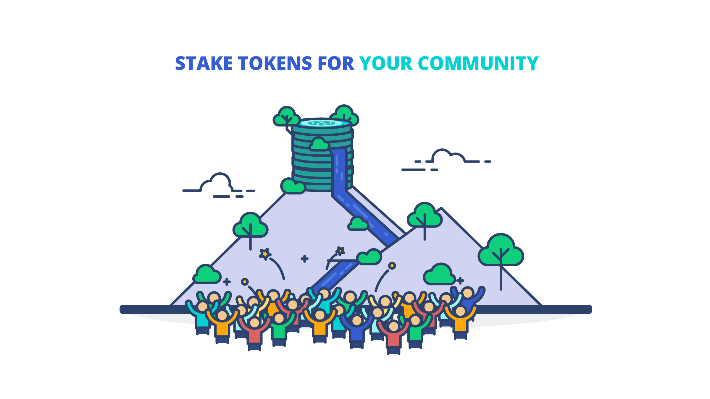
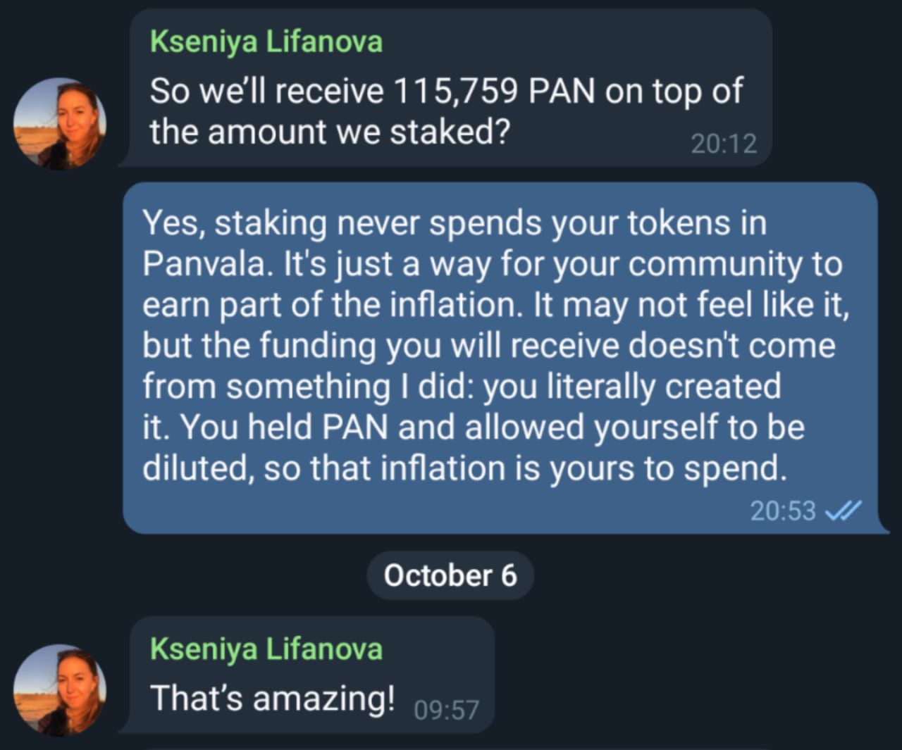

# Staking PAN

Panvala League communities stake PAN tokens to earn donation matching **capacity** from Panvala’s inflation. Their capacity is determined by their share of the total staked tokens. Once they have capacity, they use their capacity by bringing in donations for the treasury to match using quadratic funding. If you're ready to stake, head to [panvala.com/staking](https://panvala.com/staking) to get started.

Panvala is inspired by cooperatives: it’s more about how much you **use** than how much you **own**, so the rules allow communities to earn a larger share of inflation than their share of the staked tokens. The Panvala League's goal is for communities to own the same share of Panvala as the share of the budget they want to receive, so we reward them for it with a higher matching multiplier. It’s always good to get as many donations as you can, but once your community starts exceeding its capacity, you want to get more stakers to support your community as well.

For example, if your community has 10% of the staked tokens and your community has 5% of the donations, you’re within your capacity! You’ll get fully matched at the highest available multiplier for your community.

However, if your cluster has 10% of the staked tokens but your community has 15% of the donations, you’ve exceeded your capacity. You’ll be fully matched for the first 10%, but the more you exceed your capacity, the harder it is to earn more tokens for your matching budget. Your budget always increases with more donations, but your multiplier will end up lower than the communities that didn’t exceed their capacity.

In Panvala, the _hodlers are the philanthropists_ who match your donations by diluting their holdings each quarter. [The funding comes from inflation](pan-token-economics.md), not from the tokens staked for each community.

